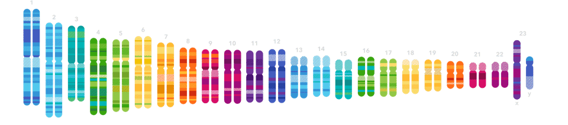
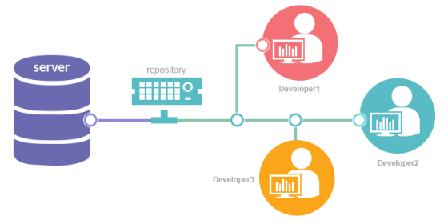
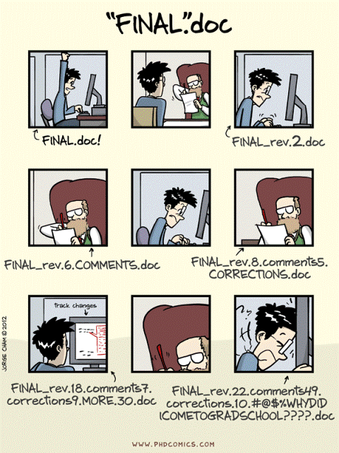
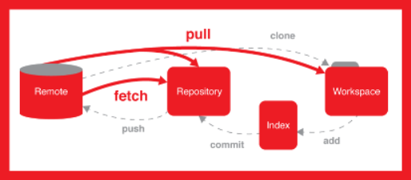
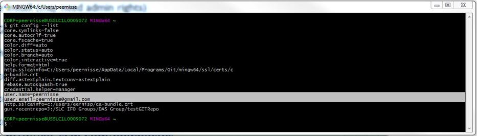
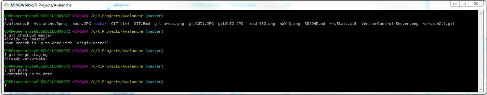
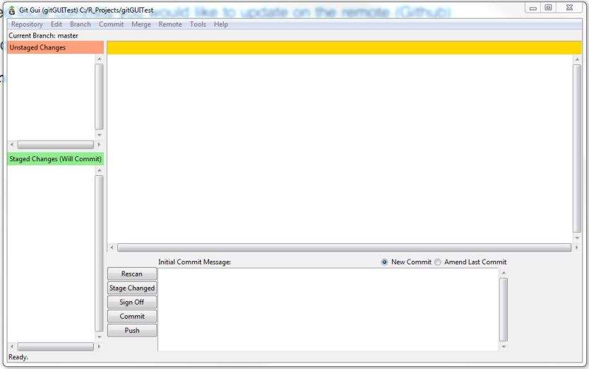

```{r setup, include=FALSE,echo=FALSE,message=F,error=F}
knitr::opts_chunk$set()
setwd("C:/R_Projects/Avalanche")
```

# Safety Moment - 'Open Source' Genetic Screening xx

* DNA analysis company 23andMe received approval Tuesday from the US Food and Drug Administration to market at-home cancer screenings as part of its test kits.

* This is the first time that the US FDA has approved a direct-to-consumer genetics test for cancer risk.

* The FDA has allowed 23andMe to market tests that assess genetic risks for breast, ovarian and prostate cancer as well as at least 10 additional diseases or conditions. 



# Safety Moment - 'Open Source' Genetic Screening


### Problems With This

* “The test only detects three out of more than 1,000 known BRCA mutations. This means a negative result does not rule out the possibility that an individual carries other BRCA mutations that increase cancer risk.” *- US FDA*

* There is no interpretation by a physician or other professional, nor additional tests.

* The concern is a false negative conclusion by citizens who will not follow up.

* Also, what does it mean that a global service has been 'approved' by just the nation in which it resides?

### Sources
* http://fortune.com/2018/03/07/23andme-fda-approval-cancer-screening/
* https://www.npr.org/sections/health-shots/2017/04/07/522897473/fda-approves-marketing-of-consumer-genetic-tests-for-some-conditions
* https://www.theatlantic.com/health/archive/2018/03/23andme-brca-breast-cancer/554957/


# GIT Presentation Overview


I will go back and forth between slides and a few program interfaces.

## Disclaimer
* I am no expert in GIT.
* GIT could be useful for our group.
* GIT is a pretty complex subject in its own right.
* Who is using GIT currently?

## Objectives

1. GIT  Overview
2. GIT and RStudio                  
3. GitHub
4. Visual Studio Team Services
5. GIT on our Servers

# Version Control

Version control is a system that records changes to a file or set of files over time so that you can recall specific versions later.

http://git-scm.com/book/en/Getting-Started-About-Version-Control

* Many of us constantly create something, save it, change it, then save it again 
* Version (or revision) control is a means of managing this process in a reliable and efficient way 
* Especially important when collaborating with others 

http://en.wikipedia.org/wiki/Revision_control



# Version Control




# What is GIT



"Git is a free and open source distributed version control system designed to handle everything from small to very large projects with speed and efficiency." *- Roger Peng*

http://git-scm.com/

* Created by the same people who developed Linux 
* The most popular implementation of version control today 
* Everything is stored in local repositories on your computer 
* Operated from the command line, GIT GUI, or in our case RStudio!

http://git-scm.com/book/en/Getting-Started-A-Short-History-of-Git


# Installing and Configuring GIT

* Download from http://git-scm.com/downloads
* Run the install (may need admin rights)
* Open GIT Bash
* Enter the following

1. git config - -global user.name "Your Name Here" 
2. git config - -global user.email "your_email@example.com"
3. git config - -list



# Git Bash Command Line

##Some simple commands
* pwd     - Print working directory
* ls      - List files and folders
* cd      - Change directory
* clear   - Clear out the commands in window
* mkdir   - Make a new directory
* touch   - Create new empty file
* cp      - Copy (file,directory)
* mv      - Move files (file, directory)
* rm      - Delete directories or files (careful)

# Git Bash Command Line

##GIT commands

* git add     - .adds all new files
* git commit    - commits changes
* git push      - push changes to your remote branch
* git checkout -b branchname - Create a new branch
* git branch - see what branch you are on
* git pull - pull data from a branch to your local repo
* git fetch - 
* git merge childbranchname



https://www.atlassian.com/git/tutorials

# GIT GUI

There is a GUI that loads with GIT for managing files without the command line.



This has so far been more confusing than useful.

# GIT and RStudio
* RStudio interfaces with GIT!
* This is enabled when you initiate your work as an R Project (.RProj)

## Create a GIT Repo in a new project folder
* This is the method to use to set up a GIT repo in your local working directory. Others can then fork from this and it serves as the master branch.
* Branches cannot be made from RStudio
* Use Git Bash and type "git checkout -b" new-branch name

## Clone from an Existing Repo
* This method sets up an R Project based on an existing repo such as on GitHub or VSTS.


# Github

* https://github.com/peernisse

* Very popular with developers
* R packages are often available in beta from people's GitHub
* Way services than just GIT


# VisualStudio Team Services
* This is available to Stantec users as part of our Office 365 account
* Seems like a mashup of GIT, MS Project, MS SharePoint
* Way services than just GIT, issue tracking, online servieces

# GIT on our Servers
* To keep in Stantec policy we can use the benefits of GIT within the confines of our own network.

* This means setting up an R Project in a server directory and treating that like the master branch.


